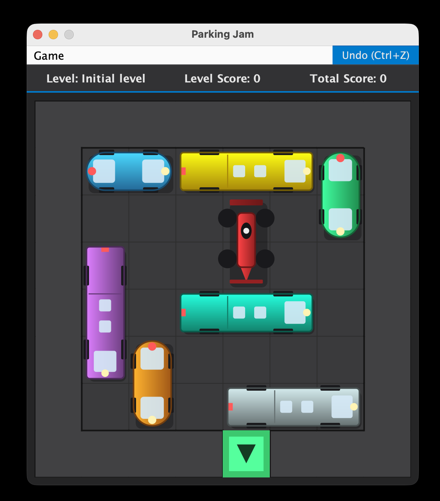

# Parking Jam

---
Java-based implementation of the famous puzzle game in which the objective is to move vehicles to allow the red car to exit the parking area.

<p align="center">
  
</p>


## Table of Contents

1. [Features](#features)
2. [System Requirements](#system-requirements)
3. [Build and Installation](#build-and-installation)
4. [Running the Application](#running-the-application)
5. [Project Structure](#project-structure)
6. [Game Mechanics](#game-mechanics)
7. [Level File Format](#level-file-format)
8. [Controls](#controls)
9. [Architecture](#architecture)
10. [Testing](#testing)
11. [Build Quality](#build-quality)
12. [Logging](#logging)
13. [Authors](#authors)
14. [Additional Information](#additional-information)

---

## Features

### Core Gameplay Features
- **Multiple Levels:** Load and play through various levels
- **Vehicle Movement:** Move vehicles horizontally and vertically using an intuitive mouse drag interface
- **Red Car Detection:** Automatically detect when the red car reaches the exit
- **Level Progression:** Automatic advancement to the next level upon victory
- **Movement History:** Track all vehicle movements throughout the game
- **Victory Conditions:** Comprehensive validation of win conditions and automatic level completion

### Game Management Features
- **Start New Game:** Begin a fresh game from level 1
- **Restart Level:** Reset the current level to its initial state
- **Undo Movements:** Undo the last move made (with full movement history support)
- **Save Game:** Save the current game state to a file, preserving level progress, score, and board state
- **Load Game:** Load a previously saved game and continue playing from where you left off
- **Game State Persistence:** Complete serialization of game state including vehicle positions, scores, and movement history

### Board and Vehicle Features
- **Board Squares:** Grid-based board layout with walls, empty spaces, and exit points
- **Vehicle Types:**
  - Red car (player target, fixed size of 2 cells)
  - Other vehicles (various sizes, 2+ cells each)
- **Collision Detection:** Comprehensive collision handling preventing invalid moves

### Scoring System
- **Level Scoring:** Points awarded based on the number of moves required to complete a level
- **Total Score:** Cumulative score across all completed levels
- **Score Persistence:** Scores are saved and loaded with game state

### User Interface
- **Java Swing GUI:** Cross-platform graphical interface
- **Visual Board Display:** Color-coded rendering of all game elements
- **Menu System:** Complete menu with File and Game menus
- **Dialog Support:** User-friendly dialogs for save/load operations and error messages
- **Keyboard Shortcuts:** Ctrl+Z for undo functionality, among others
- **Status Display:** Real-time display of current level, scores, and game status

### Level Management
- **Text-based Level Format:** Plain text level files with standardized format
- **Level Validation:** Comprehensive validation rules for level correctness
- **Multiple Level Support:** Support for loading multiple levels sequentially
- **Error Handling:** Detailed error messages for invalid level files
- **Level Information:** Display of level names and progression information

### Technical Features
- **Logging System:** SLF4J with Log4J integration for comprehensive logging
- **Error Handling:** Robust exception handling throughout the application
- **Data Persistence:** Save/load functionality for game state
- **MVC Architecture:** Clean separation of concerns using Model-View-Controller pattern
- **Service Layer:** Well-organized business logic services
- **Data Access Objects:** Abstracted data access for levels and saved games

---

## System Requirements

- **Java:** JDK 11 or newer
- **Maven:** 3.6 or newer
- **Git:** For cloning the repository
- **Operating System:** Works on Linux, macOS, and Windows
- **GUI Support:** System with graphical desktop environment (Swing-based)

### Recommended
- **IDE:** IntelliJ IDEA, Eclipse, or VS Code with Java extensions
- **Virtual Machine:** Ubuntu 20.04 (for evaluation environment)

---

## Build and Installation

### Prerequisites
Ensure you have Java 11 and Maven installed:

```bash
java -version
mvn -version
```

### Clone and Setup

```bash
# Clone the repository
git clone https://costa.ls.fi.upm.es/gitlab/230291/parking-jam.git
cd parking-jam

# Verify the structure
ls -la
```

### Compile the Project

```bash
# Clean and compile
mvn clean compile

# Or compile and package
mvn clean package
```

This will:
- Download dependencies from Maven repositories
- Compile source code
- Run all tests
- Generate the executable JAR file

---

## Running the Application

### Option 1: Using Maven (Recommended)

```bash
mvn exec:java
```

This directly runs the application without creating a JAR file.

### Option 2: Using the Packaged JAR

```bash
mvn clean package
java -jar target/parking-jam-1.0-SNAPSHOT.jar
```

This creates a shaded JAR with all dependencies included and runs it.

### Option 3: From IDE

- Open the project in your IDE
- Navigate to `src/main/java/es/upm/pproject/parkingjam/App.java`
- Right-click and select "Run"

---

## Project Structure

```
parking-jam/
├── src/
│   ├── main/
│   │   ├── java/es/upm/pproject/parkingjam/
│   │   │   ├── App.java                    # Application entry point
│   │   │   ├── controller/
│   │   │   │   ├── GameController.java     # Controller interface
│   │   │   │   └── GameControllerImpl.java  # Controller implementation
│   │   │   ├── model/
│   │   │   │   ├── dao/
│   │   │   │   │   ├── BoardValidation.java    # Validates Board from .txt file
│   │   │   │   │   ├── LevelDAO.java           # Level file loader
│   │   │   │   │   └── SaveGameDAO.java        # Game state persistence
│   │   │   │   ├── dto/
│   │   │   │   │   ├── Board.java          # Game board representation
│   │   │   │   │   ├── GameState.java      # Complete game state
│   │   │   │   │   ├── Level.java          # Level data
│   │   │   │   │   ├── Vehicle.java        # Vehicle representation
│   │   │   │   │   ├── Position.java       # Cell coordinates
│   │   │   │   │   ├── Move.java           # Movement record
│   │   │   │   │   ├── Direction.java      # Movement direction enum
│   │   │   │   │   ├── Orientation.java    # Vehicle orientation
│   │   │   │   │   └── SavedGame.java      # Saved game data
│   │   │   │   ├── services/
│   │   │   │   │   ├── GameService.java    # Core game logic interface
│   │   │   │   │   ├── GameServiceImpl.java # Game service implementation
│   │   │   │   │   ├── MovementService.java
│   │   │   │   │   ├── MovementServiceImpl.java
│   │   │   │   │   ├── CollisionService.java
│   │   │   │   │   ├── CollisionServiceImpl.java
│   │   │   │   │   ├── VictoryService.java
│   │   │   │   │   ├── VictoryServiceImpl.java
│   │   │   │   │   ├── ScoreService.java
│   │   │   │   │   └── ScoreServiceImpl.java
│   │   │   │   └── exceptions/
│   │   │   │       ├── BoardValidationException.java
│   │   │   │       ├── LevelDAOException.java
│   │   │   │       ├── LevelFormatException.java
│   │   │   │       ├── LevelNotFoundException.java
│   │   │   │       ├── VehicleNotFoundException.java
│   │   │   │       └── SaveGameDAOException.java
│   │   │   └── view/
│   │   │       ├── MainView.java           # Main window (Swing JFrame)
│   │   │       ├── BoardPanel.java         # Game board rendering
│   │   │       └── GameDialogs.java        # Dialog utilities
│   │   └── resources/
│   │       └── log4j.properties            # Logging configuration
│   └── test/
│       └── java/es/upm/pproject/parkingjam/
│           ├── unit/                       # Unit tests
│           │   ├── dao/
│           │   ├── dto/
│           │   └── services/
│           └── integration/                # Integration tests
├── resources/
│   ├── levels/                             # Level files (.txt format)
│   └── invalid_levels/                     # Invalid level examples
├── deliverables/                           # Sprint deliverables
├── pom.xml                                 # Maven configuration
├── .gitlab-ci.yml                          # CI/CD pipeline
└── README.md                               # This file
```

---

## Game Mechanics

### Victory Condition
The game is completed when:
1. The red car (marked with `*`) reaches the exit point (marked with `@`)
2. The red car must be positioned such that it can move to the exit
3. Upon victory, the level score is calculated and the next level is automatically loaded

### Scoring System
- **Level Score:** Calculated based on the number of moves required to solve the level
- **Total Score:** Sum of all level scores across completed levels
- **Score Tracking:** Scores are maintained even after loading a saved game

### Movement Rules
- Vehicles can only move **horizontally or vertically**, not diagonally
- Each move advances a vehicle by exactly **one cell**
- A vehicle cannot move through walls or other vehicles
- The primary drag axis determines the movement direction:
  - Horizontal drag = East/West movement
  - Vertical drag = North/South movement

### Collision Detection
- The system prevents moves that would cause:
  - Vehicles to overlap (collision)
  - Vehicles to move outside the board boundaries
  - Vehicles to pass through walls
- All attempted moves are validated before execution

### Vehicle Requirements
- The red car must always have exactly **size 2** (occupies 2 cells)
- Other vehicles must have **size ≥ 2** (occupy at least 2 contiguous cells)
- All vehicles must have at least **2 neighboring elements** (either walls or other vehicles, forming an L or T shape minimum)

---

## Level File Format

### File Location
Level files are stored in `resources/levels/` directory as plain text files with naming convention: `level_N.txt`

### File Structure
```
<Level Name>
<rows> <columns>
<row_1_content>
<row_2_content>
...
<row_N_content>
```

### Example

```
Initial level
8 8
++++++++
+aabbbc+
+...*.c+
+d..*..+
+d.fff.+
+de....+
+.e.ggg+
++++@+++
```

### Valid Characters

| Character | Meaning | Description |
|-----------|---------|-------------|
| `+` | Wall | Board boundary or internal wall |
| `.` | Empty Cell | Free space for movement |
| `*` | Red Car | Player's target vehicle (must be size 2) |
| `@` | Exit | Goal position where red car must reach |
| `a`-`z` | Vehicles | Other vehicles (each letter represents a different vehicle) |

### Validation Rules

The parser enforces the following rules:

1. **Exit Count:** Exactly one exit (`@`) required per level
2. **Red Car:** Exactly one red car (`*`) required, must have size 2 (occupy 2 cells)
3. **Vehicle Sizes:** All vehicles (`a`-`z`) must occupy at least 2 contiguous cells:
   - Contiguous means adjacent horizontally or vertically
   - Vehicles cannot be contained within the same cells
4. **Board Dimensions:** All rows must exactly match the declared number of columns
5. **Character Validation:** Only allowed characters are processed; others cause errors
6. **Vehicle Neighbors:** Each vehicle must have at least 2 neighboring elements:
   - Neighbors can be walls, other vehicles, or the exit
   - Forms L-shaped or T-shaped minimum configurations

### Invalid Level Examples

```
# Missing exit
++++
+**+
++++

# Red car with wrong size
+++++
+***@
+aa.+
+++++

# Vehicle 'a' only occupies 1 cell
++++
+**@
+a.+
++++
```

---

## Controls

### Mouse Controls

- **Click and Drag:** Click on a vehicle and drag to move it
  - Drag **horizontally** (left/right) to move the vehicle East or West
  - Drag **vertically** (up/down) to move the vehicle North or South
- **Move Distance:** Each drag action moves the vehicle by exactly one cell
- **Invalid Moves:** Rejected automatically if they would cause collisions or boundary violations

### Keyboard Controls

- **Ctrl+Z:** Undo the last move
- **Ctrl+Q:** Close the application (with confirmation)
- **Ctrl+N:** Start a new game
- **Ctrl+R:** Restart current game (with confirmation)
- **Ctrl+S:** Save the current game (select location)
- **Ctrl+L:** Load the current game (select location)

### Menu Commands

#### File Menu
- **New Game:** Start a fresh game from level 1 (with confirmation)
- **Exit:** Close the application (with confirmation)

#### Game Menu
- **Restart Level:** Reset the current level to its initial state (with confirmation)
- **Save Game:** Save the current game state to a user-selected file location
- **Load Game:** Load a previously saved game from a user-selected file
- **Undo** (button on menu bar): Undo the last movement (Ctrl+Z)

### Game Flow

1. Application starts with level 1
2. Player moves vehicles by dragging
3. When red car reaches exit, level completes automatically
4. System shows level score and automatically loads next level
5. Game ends when no more levels are available (congratulations message)

---

## Architecture

The project follows the **Model-View-Controller (MVC)** architectural pattern:

```
┌─────────────────────────────────────┐
│         View (UI Layer)             │
│  - MainView (Swing JFrame)          │
│  - BoardPanel (Game board display)  │
│  - GameDialogs (User interactions)  │
└────────────┬────────────────────────┘
             │ (User input & callbacks)
             ↓
┌─────────────────────────────────────┐
│    Controller (Coordination)        │
│  - GameController (Interface)       │
│  - GameControllerImpl (Logic flow)   │
└────────────┬────────────────────────┘
             │ (Game commands)
             ↓
┌─────────────────────────────────────┐
│      Model (Business Logic)         │
│  ┌─────────────────────────────────┐│
│  │     Services (Game Rules)       ││
│  │ - GameService                   ││
│  │ - MovementService               ││
│  │ - CollisionService              ││
│  │ - VictoryService                ││
│  │ - ScoreService                  ││
│  └─────────────────────────────────┘│
│  ┌─────────────────────────────────┐│
│  │   Data Objects (DTO)            ││
│  │ - Board, Vehicle, Position      ││
│  │ - GameState, Move, Direction    ││
│  └─────────────────────────────────┘│
│  ┌─────────────────────────────────┐│
│  │   Data Access (Persistence)     ││
│  │ - LevelDAO (read levels)        ││
│  │ - SaveGameDAO (save/load state) ││
│  │ - BoardValidation (check board) ││
│  └─────────────────────────────────┘│
└─────────────────────────────────────┘
```

### Key Components

**View Layer:**
- Renders game board and UI elements
- Handles mouse/keyboard input
- Displays dialogs and messages
- Updates based on controller updates

**Controller Layer:**
- Mediates between View and Model
- Orchestrates game flow
- Handles level loading and transitions
- Manages save/load operations

**Service Layer:**
- **GameService:** Manages overall game state and flow
- **MovementService:** Validates and executes vehicle movements
- **CollisionService:** Detects and prevents collisions
- **VictoryService:** Checks win conditions
- **ScoreService:** Calculates and tracks scores

**Data Access Layer:**
- **LevelDAO:** Reads and parses level files from disk
- **SaveGameDAO:** Writes and reads game state files

**Model Objects:**
- Immutable or semi-immutable data structures representing game entities
- Support serialization for save/load functionality

---

## Testing

### Test Framework
- **JUnit 5.6.2:** Modern testing framework with assertions and parameterized tests
- **Test Scope:** Configured with Maven Surefire plugin
- **Coverage Tool:** JaCoCo for code coverage measurement

### Running Tests

```bash
# Run all tests
mvn test

# Run specific test class
mvn test -Dtest=BoardTest

# Run tests with coverage report
mvn clean test jacoco:report
# Report located at: target/site/jacoco/index.html
```

### Test Organization

```
src/test/java/es/upm/pproject/parkingjam/
├── unit/                           # Unit tests (isolated components)
│   ├── dao/
│   │   ├── LevelDAOTest.java       # Level file parsing
│   │   └── SaveGameDAOTest.java    # Game state serialization
│   ├── dto/
│   │   ├── BoardTest.java
│   │   ├── VehicleTest.java
│   │   ├── GameStateTest.java
│   │   ├── MoveTest.java
│   │   ├── PositionTest.java
│   │   ├── DirectionTest.java
│   │   ├── LevelTest.java
│   │   └── SavedGameTest.java
│   └── services/
│       ├── GameServiceImplTest.java
│       ├── MovementServiceImplTest.java
│       ├── CollisionServiceImplTest.java
│       ├── VictoryServiceImplTest.java
│       └── ScoreServiceImplTest.java
└── integration/
    └── IntegrationTest.java        # End-to-end game flow tests
```

### Test Coverage

Tests cover:
- **Unit Tests:** Individual components and business logic
  - Data structures (Board, Vehicle, Position)
  - Service logic (movement, collision, victory, scoring)
  - Data persistence (level loading, save/load)
- **Integration Tests:** Complete game flows
  - Level loading and progression
  - Multi-move game sequences
  - Save and load operations
  - Undo functionality

### Code Coverage Exclusions

The following are excluded from coverage calculation (configured in `pom.xml`):
- `view/**/*.java` - GUI rendering code
- `controller/**/*.java` - Coordination glue code

Only model classes are considered for coverage measurement, focusing on business logic quality.

---

## Build Quality

### Continuous Integration

The project uses **GitLab CI/CD** (`gitlab-ci.yml`) which:
- Automatically runs tests on each push
- Performs SonarQube analysis for code quality
- Generates coverage reports with JaCoCo
- Sends email notifications on test failures

### Code Quality Analysis (SonarQube)

The project integrates with **SonarQube** for comprehensive code analysis:

```bash
# Run local analysis
mvn clean verify sonar:sonar \
  -Dsonar.id=<numero de matricula> \
  -Dsonar.login=<token>
```

---

## Logging

### Logging Configuration

The project uses **SLF4J** with **Log4J** backend for flexible, production-grade logging.

### Configuration File

Location: `src/main/resources/log4j.properties`

Configuration includes:
- Log levels (DEBUG, INFO, WARNING, ERROR)
- Output file location: `log/output.log`
- Rolling file configuration with backups
- Timestamp and class information in log messages

### Log Output

Logs are written to:
- `log/output.log` - Primary log file
- `log/output.log.1`, `log/output.log.2`, etc. - Rotated backups when log size exceeds threshold

### Log Messages

The application logs:
- Application startup and shutdown
- Level loading operations
- Game state transitions
- Movement attempts and results
- Victory conditions
- Save/load operations
- Error conditions and exceptions

### Example Log Output

```
2026-06-16 14:23:45 INFO Parking Jam application starting...
2026-06-16 14:23:45 DEBUG Initializing GUI...
2026-06-16 14:23:45 DEBUG Initializing LevelDAO...
2026-06-16 14:23:45 DEBUG Initializing GameService...
2026-06-16 14:23:45 DEBUG Initializing GameController...
2026-06-16 14:23:45 INFO Starting new game...
2026-06-16 14:23:47 INFO Loading level 1 with total score 0
2026-06-16 14:23:48 INFO Vehicle * moved from [Position...] to [Position...]
2026-06-16 14:23:50 INFO Level 1 completed with score 10
2026-06-16 14:23:50 INFO Loading level 2 with total score 10
```

---

## Authors

- Alejandro Hernández Sánchez (230291)
- Carlos Sánchez Herrero (230150)
- Pedro Valcárcel Montiel (230061)
- Asier Rioja Perales (230042)

---

## Additional Information

### Project Deliverables

- **Backlog:** CSV files documenting user stories and requirements (backlog1.csv, backlog2.csv, backlog3.csv)
- **Sprint Boards:** Screenshots of Kanban boards from each sprint
- **Sprint CSV Files:** Detailed sprint planning and completion data
- **Code:** Complete source code with full test coverage

### Development Practices

- **Test-Driven Development (TDD):** Tests written before or alongside production code
- **Version Control:** Git with GitLab hosting and CI/CD
- **Code Quality:** SonarQube analysis with quality gates
- **Documentation:** Comprehensive code comments and README

---

**Version:** 2.0 (Final Version)  
**Last Updated:** June 16, 2026  
**Status:** Complete and Production-Ready
